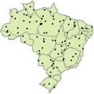

# febr 

[](http://www.repostatus.org/#active)
[](https://travis-ci.org/febr-team/febr-package)
[](https://cran.r-project.org/package=febr)
[](http://www.rdocumentation.org/packages/febr)

## Apresentação

O Repositório Brasileiro Livre para Dados Abertos do Solo -- <font face="Comfortaa">febr</font>, http://www.ufsm.br/febr/ -- foi criado com o propósito de servir de plataforma para a compilação e organização colaborativa, e publicação aberta de todos os tipos de dados do solo produzidos no Brasil. Para isso, são usados padrões definidos coletivamente, baseados em experiências internacionais, principalmente uma política de dados abertos, primando pela facilidade de acesso, manutenção e uso. A meta é constituir um repositório central para armazenar e servir dados do solo em formato padronizado e harmonizado para várias aplicações. Dentre estas estão:

* Construção de sistemas inteligentes de recomendação de fertilizantes,
* Condução de experimentos agronômicos de larga escala espacial e temporal,
* Calibração de funções de pedotransferência para todo o território brasileiro,
* Realização do Programa Nacional de Solos do Brasil ([PronaSolos][pronasolos]) e as iniciativas internacionais de mapeamento do solo, como o [GlobalSoilMap][gsm] e o *Global Soil Partnership* ([GSP][gsp]),
* Melhoria do Sistema Brasileiro de Classificação do Solo ([SiBCS][sibcs]) e dos sistemas internacionais *Soil Taxonomy* ([ST][st]) e *World Reference Base for Soil Resources* ([WRB][wrb]), além da criação do *Universal Soil Classification System* ([USCS][uscs]),
* Desenvolvimento de bases de dados especializadas como o Banco de Dados Hidro-Físicos de Solos do Brasil ([HYBRAS][hybras]), a Biblioteca Espectral de Solos do Brasil ([BESB][besb]), e o Sistema de Informação de Solos Brasileiros ([BDSolos][sisb]),
* E muito mais.

[sisb]: https://www.bdsolos.cnptia.embrapa.br/consulta_publica.html
[uscs]: https://www.nrcs.usda.gov/wps/portal/nrcs/detail/soils/survey/class/?cid=nrcs142p2_053562
[wrb]: http://www.fao.org/soils-portal/soil-survey/soil-classification/world-reference-base/en/
[st]: https://www.nrcs.usda.gov/wps/portal/nrcs/main/soils/survey/class/taxonomy/
[sibcs]: https://www.embrapa.br/solos/sibcs
[gsp]: http://www.fao.org/global-soil-partnership/en/
[gsm]: http://www.globalsoilmap.net/
[pronasolos]: https://www.embrapa.br/busca-de-publicacoes/-/publicacao/1054924/programa-nacional-de-solos-do-brasil-pronasolos
[hybras]: http://www.cprm.gov.br/publique/Hidrologia/Hidrologia-de-Solos/Produtos-4601.html
[besb]: http://bibliotecaespectral.wixsite.com/esalq

O uso de uma instalação central para o armazenamento coletivo e compartilhamento aberto de dados do solo como o <font face="Comfortaa">febr</font> reduz os esforços duplicados de recuperação de dados do solo. Também potencializa a 'descobertabilidade' (do inglês, *discoverability*) e 'reusabilidade' (do inglês, *reusability*) dos dados do solo, elementos fundamentais para garantir a reprodutibilidade da pesquisa. Isso tudo permite que os já escassos recursos disponíveis para a ciência sejam usados de maneira mais racional, principalmente para maximizar a colaboração entre cientistas do solo e destes com cientistas de outras áreas do conhecimento. Em longo prazo, isso deve alavancar o avanço do conhecimento sobre o solo e, assim, auxiliar na tomada de decisão para a gestão sustentável dos recursos naturais nas próximas décadas e pelas gerações futuras.

Para facilitar ainda mais a reutilização dos dados do solo publicados no <font face="Comfortaa">febr</font>, cientistas do solo têm à sua disposição o pacote `febr` para o R.

## Instalação

O pacote `febr` ainda não está disponível no [CRAN][cran]. Mas a versão de desenvolvimento, disponível no [GitHub][github], pode ser instalada -- usando o pacote `devtools` -- da seguinte maneira:

[cran]: https://CRAN.R-project.org
[github]: https://github.com/febr-team/febr-package

```R
if (!require(devtools)) {
  install.packages(pkgs = "devtools")
}
devtools::install_github(repo = "febr-team/febr-package")
```

## Utilização básica

O pacote `febr` possui cinco funções para descarregamento de dados:

1. `dataset`, para descarregar os dados sobre um conjunto de dados;
2. `observation`, para descarregar os dados das observações do solo de um conjunto de dados;
3. `layer`, para descarregar os dados das camadas das observações do solo de um conjunto de dados;
4. `metadata`, para descarregar os dados sobre os dados de um conjunto de dados;
5. `febr`, para descarregar todos os dados e metadados de um conjunto de dados.

O principal argumento dessas cinco funções é `dataset`. Para esse argumento é passado o código de identificação de um ou mais conjuntos de dados publicados no <font face="Comfortaa">febr</font>. Isso descarrega os dados da tabela de dados indicada pela função escolhida. Por exemplo,

```R
observation(dataset = "ctb0003")
```

descarrega os dados das observações do solo do conjunto de dados `ctb0003`. O código de identificação de todos os conjuntos de dados publicados no <font face="Comfortaa">febr</font> estão catalogados em http://www.ufsm.br/febr/catalog/.

No caso das funções `observation`, `layer` e `febr`, o segundo principal argumento é `variable`. Para esse argumento é passado o código de identificação da(s) variável(is) cujos dados devem ser retornados pela função escolhida. Por exemplo,

```R
layers(dataset = "ctb0003", variable = "argila")
```

retorna os dados de argila do conjunto de dados `ctb0003`. O código de identificação de todas as variáveis contidas nos conjuntos de dados publicados no <font face="Comfortaa">febr</font> estão catalogados em https://goo.gl/hi77sB.

## Como colaborar

Nós usamos o modelo de desenvolvimento colaborativo *fork & pull*. Isso significa que você tem liberdade para fazer um cópia paralela -- *fork* -- deste repositório, alterar o código fonte conforme julgar necessário e depois empurrar -- *push* -- as alterações para a sua cópia pessoal deste repositório. Isso tudo sem que seja necessário pedir qualquer autorização. Caso as alterações que você realizou na sua cópia pessoal deste repositório sejam interessantes e você tem interesse em compartilhar as mesmas conosco, então basta solicitar que sejam puxadas -- *pull request* -- para este repositório. Depois de uma revisão das alterações, nós decidiremos se elas podem ser fundidas -- *merge* -- com o código fonte deste repositório.

Sinta-se à vontade para propor melhorias e estudar o código fonte (e a documentação). Afinal de contas, o <font face="Comfortaa">febr</font> é um repositório livre!
